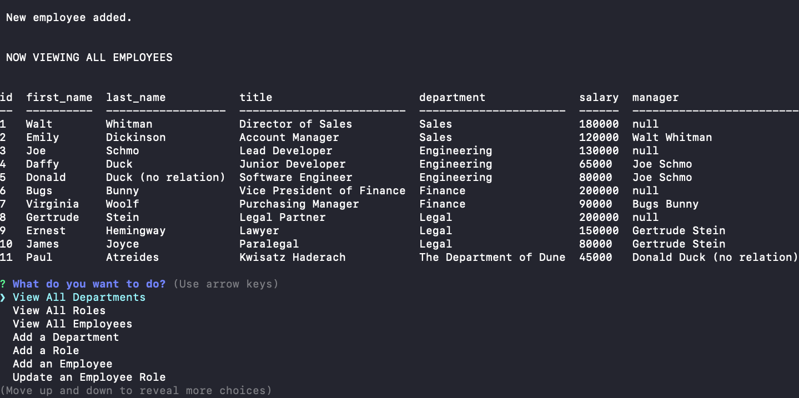

# employee-tracker

## Description
This is a command-line application that allows the user to access a content management system that interacts with a company's employee database. The company is hypothetical, but the app is real, and was developed primarily to help me practice working with databases, Node.js, and MySQL. Also getting more familiar with the good old principles of CRUD.

[Here's a link to a video demo showing how it works](https://drive.google.com/file/d/1_X7uqyT5WLuHA24RRBDPG99TdyL-uEcE/view)

## Table of Contents

- [Installation](#installation)
- [Usage](#usage)
- [Credits](#credits)

## Installation

Download the code off of this GitHub repo. Make sure you've installed/saved the following dependencies (npm install "x" --save) via the command line: Express, Inquirer, mysql2, and cTable.

## Usage

Once you've downloaded the files, navigate to the employee-tracker folder using the CLI of your choice. From the command line, enter "npm start" or "node server.js". Follow the user prompts to view specific employee and/or departmental data in the (hypothetical) company's database. You can also choose to add data, and will again be prompted accordingly. Updated tables will show after you've made a new entry. 

Word of warning: As of Oct. 29, this app was slightly unfinished. There is no functionality to "update" an employee's role. (The "exit" option also doesn't do anything, although you can close your command line interface or enter control-C or close your computer and go outside and look at the sky whenever you get sick of interacting with this database.)

## Credits

The following links and documentation are just a sampling of the online resources that proved helpful as I was working on this: 

- https://stackoverflow.com/questions/64220107/passing-sql-queries-into-inquirer-prompt
- https://stackoverflow.com/questions/63005429/passing-promises-with-mysql-nodejs
- https://www.npmjs.com/package/mysql2
- https://www.npmjs.com/package/console.table
- https://www.npmjs.com/package/inquirer
- https://www.w3schools.com/sql/func_mysql_concat.asp
- https://2u-20.wistia.com/medias/2lnle7xnpk
- https://developer.mozilla.org/en-US/docs/Web/JavaScript/Reference/Global_Objects/Array/map
- https://blog.logrocket.com/node-js-express-js-mysql-rest-api-example/